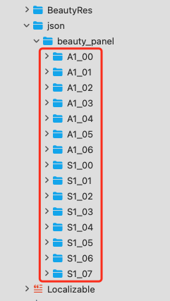

简体中文  |  [English](https://github.com/Tencent-RTC/TencentEffect_iOS/blob/main/TEBeautyDemo/README.md)

# TEBeautyDemo

本工程是 TencentEffectSDK 的 demo 工程，演示了如何带 UI 接入 TencentEffectSDK。UI样式如下：

# 快速开始

- 【可选】修改 TEBeautyKit中的TencentEffectSDK的套餐。如果不修改，则默认使用S1-07套餐。如需修改，请将 TEBeautyKit/TEBeautyKit.podspec中的s.dependency 'TencentEffect_S1-07'修改为你使用的套餐，例如 s.dependency 'TencentEffect_S1-04'

- 修改 TEBeautyDemo/ViewController.m：将 license url 和 license key 设置为你在腾讯云控制台申请到的 URL 和 Key。

- 修改bundled:  TEBeautyDemo project-->TARGETS-->TEBeautyDemo-->Signing & Capabilities-->Bundle Identifier，将 Bundle Identifier 修改为你的包名，并确保该包名与上一步的 license url 和 Key 是匹配的。

- 在TEBeautyDemo根目录下执行 pod install，执行完毕后打开TEBeautyDemo.xcworkspace运行demo。

- 如遇到Masonry报以下错误，根据下后一张图修改对应最低支持版本号为12.0后重新运行demo。

  

  

# 自定义主分类

TencentEffectSDK的不同套餐具备不同的能力，例如某些套餐没有”美体“能力，那么 UI 面板上就不应该出现 ”美体“ 入口。自定义主分类请修改TECameraViewController的initBeautyJson方法，在[TEUIConfig shareInstance] setTEPanelViewRes:中依次设置美颜、美体、滤镜等路径，如果不需要某一类，则在对应的位置传入nil即可。

各类美颜的json配置文件位于demo工程的Pods/Development Pods/TEBeautyKit/json/beauty_panel目录，如下图所示，请在[TEUIConfig shareInstance] setTEPanelViewRes:......方法中传入正确的路径。

# 自定义滤镜/动效/分割素材列表

demo工程中自带了一些滤镜和动效素材，如果你有新增的素材，请按如下方式添加到指定目录：

- 新增加滤镜：请将滤镜图片放到 "TEBeautyDemo/lut.bundle" 目录，滤镜icon放到 "TEBeautyKit/Assets/BeautyRes下"，然后修改 "TEBeautyKit/json/beauty_panel/套餐名/lut.json"，参考已有的项目添加一项。
- 新增加动效/美妆/分割：与上一条类似，放到 "TEBeautyDemo/***.bundle"对应的bundle内，图标请放到 "TEBeautyKit/Assets/BeautyRes"，然后修改"TEBeautyKit/json/beauty_panel/套餐名"下面的makeup.json或motions.json或segmentation.json。

# 自定义美颜面板样式

TEBeautyKit的TEUIConfig.h里有若干个UIColor类型的颜色属性，你可以修改这些颜色值来自定义美颜面板的背景色、分割线颜色、选中颜色等等。如果需要更深度的定制，请修改TEBeautyKit源码。
