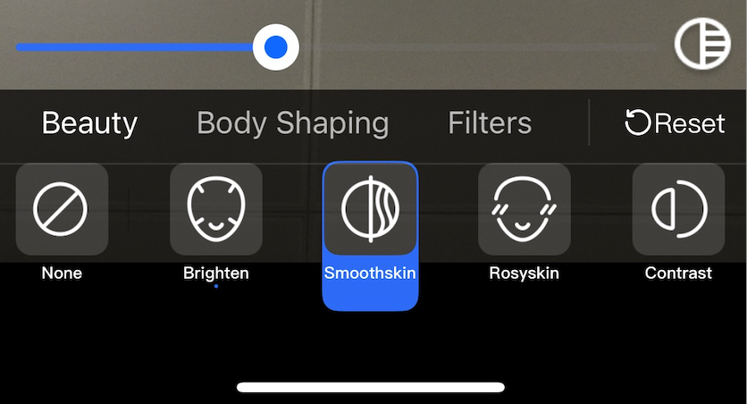
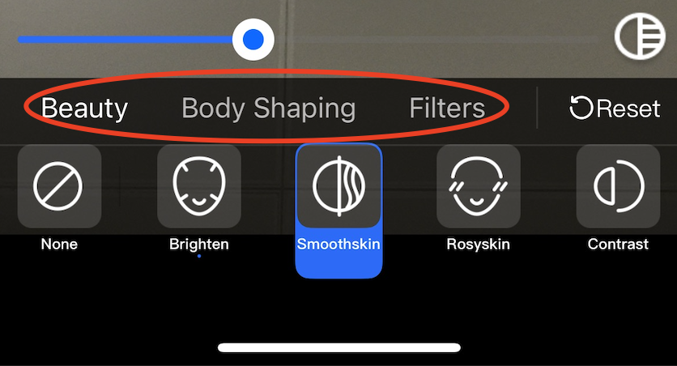

[简体中文](https://github.com/Tencent-RTC/TencentEffect_iOS/blob/main/TEBeautyDemo/README_zh_CN.md)  |  English

#  TEBeautyDemo

This project is a demo project for TencentEffectSDK, demonstrating how to integrate TencentEffectSDK with UI. The UI style is as follows.：

# Quick Start

- [Optional] Modify the TencentEffectSDK package in TEBeautyKit. If not modified, the S1-07 package will be used by default. If you need to modify it, please change `s.dependency 'TencentEffect_S1-07'` in `TEBeautyKit/TEBeautyKit.podspec` to the package you are using, such as `s.dependency 'TencentEffect_S1-04'`.

- Modify `TEBeautyDemo/ViewController.m`: Set the `license url` and `license key` to the URL and Key you applied for in the Tencent Cloud Console.

- Modify `bundled`: In `TEBeautyDemo project-->TARGETS-->TEBeautyDemo-->Signing & Capabilities-->Bundle Identifier`, change the `Bundle Identifier` to your package name, and make sure that the package name matches the license url and Key in the previous step.

- Execute `pod install` in the root directory of TEBeautyDemo, and open TEBeautyDemo.xcworkspace to run the demo after execution.

- If you encounter the following error reported by `Masonry`, modify the corresponding minimum support version number to 12.0 according to the next picture and rerun the demo.

  

  

# Customize the Main Category

Different packages of TencentEffectSDK have different capabilities. For example, if some packages do not have the "Body Beauty" capability, the "Body Beauty" entry should not appear on the UI panel. To customize the main category, please modify the initBeautyJson method of TECameraViewController, and set the paths of beauty, body beauty, filters, etc. in `[TEUIConfig shareInstance] setTEPanelViewRes:...... `in order. If you don't need a certain category, just pass in nil at the corresponding position.

The json configuration files for various beauty effects are located in the `Pods/Development Pods/TEBeautyKit/json/beauty_panel` directory of the demo project, as shown in the figure below. Please pass in the correct path in the `[TEUIConfig shareInstance] setTEPanelViewRes:...... `method.

# Customize the List of Filters/Motions/Segmentation Materials.

The demo project comes with some filter and dynamic effect materials. If you have new materials, please add them to the specified directory as follows:

- Add new filters: Please put the filter image in the `TEBeautyDemo/lut.bundle` directory, the filter icon in the `TEBeautyKit/Assets/BeautyRes` directory, and then modify the `TEBeautyKit/json/beauty_panel/package name/lut.json`file, adding an item referring to the existing project.
- Add new dynamic effects/makeup/segmentation: Similar to the previous step, put them in the corresponding bundle in `TEBeautyDemo/***.bundle`, place the icons in `TEBeautyKit/Assets/BeautyRes`, and then modify the makeup.json, motions.json, or segmentation.json files under `TEBeautyKit/json/beauty_panel/package name`.

# Customize the UI Style

In the TEUIConfig.h file of TEBeautyKit, there are several UIColor type color properties. You can modify these color values to customize the background color, dividing line color, selected color, etc., of the beauty panel. If you need deeper customization, please modify the TEBeautyKit source code.
